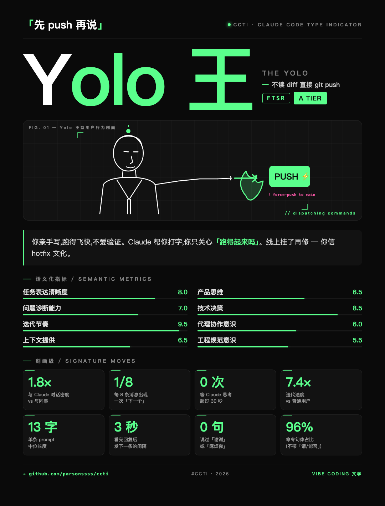
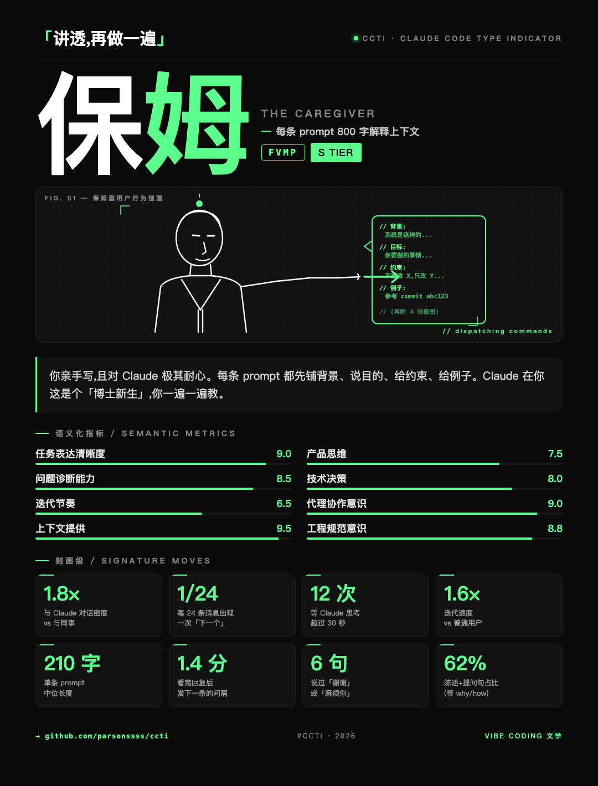
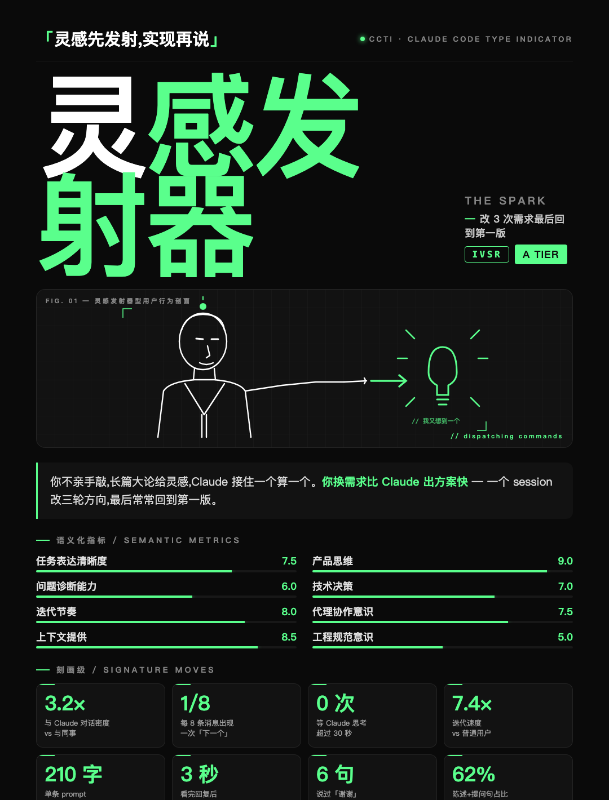

# CCTI · Claude Code Type Indicator

> 🇨🇳 [中文版 README](./README_zh.md)

> *"Are you 主谋(The Mastermind), 保姆(The Caregiver), or Yolo 王(The Yolo)?"*
>
> A Claude Code skill that reads how you collaborate with Claude in the current
> session and renders a shareable 1080×1420 PNG personality card — 16 archetypes,
> 8 academic dimension scores, 8 signature-move stats, black-white-green
> SBTI-style aesthetic.

<p align="center">
  
  &nbsp;&nbsp;
  
</p>
<p align="center">
  
  &nbsp;&nbsp;
  
</p>

> Four sample cards, four very different archetypes — note how the
> right-side SVG illustration is unique to each type:
> **ITSR · 主谋** dispatches a stack of `$ 下一个 →` commands;
> **FTSR · Yolo 王** has fire + a giant `PUSH ⚡` button (force-push to main);
> **FVMP · 保姆** holds a huge speech bubble of context comments;
> **IVSR · 灵感发射器** glows with a light-bulb + sparks.
> The 4-letter code badge (`ITSR` / `FTSR` / `FVMP` / `IVSR`) sits beside
> the tier so the type is identifiable at a glance.

## ⏳ Use it in a long-running session

CCTI is a **behavioral** test, not a survey. Claude scores the user by what
they actually did across the conversation — message length distribution,
verb/noun ratios, "下一个" / "按这个改" frequency, verification rhythm, etc.
That signal only gets reliable after enough samples.

**Run CCTI near the end of a session that has run for a while.** Ideally:

- ≥ 15 user messages
- across ≥ 2 distinct kinds of work (e.g. bug fix + new feature, or refactor + docs)
- with at least one moment where you push back / correct Claude

In a short "hi, test me" session, the card is closer to a coin flip than a
real read. The skill will still produce one — just less calibrated.

A natural prompt at the right moment:

> *"把今天这个会话当样本,跑一下 CCTI 看看我是哪种。"*
> ("Use today's session as the sample and run CCTI on me.")

---

This README is written for **AI agents** (other Claude Code instances, agent
frameworks, or developers building tooling on top of skills). For the
user-facing workflow, read [`SKILL.md`](./SKILL.md). For scoring rules read
[`references/scoring_rubric.md`](./references/scoring_rubric.md).

---

## What this skill does

When invoked, it:

1. Analyzes the user's behavior across the conversation it's running in —
   message length, command-style ratio, verification frequency, etc.
2. Maps that behavior to 4 binary axes (`F/I`, `T/V`, `S/M`, `P/R`) → one of
   16 archetype codes (e.g. `ITSR`).
3. Scores 8 academic dimensions (Task Clarity, Product Thinking, Diagnostics,
   Tech Decisions, Iteration Cadence, Agent Collab, Context Provision,
   Engineering Discipline) on a 0–10 scale.
4. Derives a Tier (S+ / S / A / B / C) from the mean of the 8 scores.
5. Picks 8 signature-move stats matching the user's axis letters.
6. Fills `assets/template.html` with the data.
7. Runs `scripts/render.py` to produce a PNG (cross-platform Chrome / Chromium /
   Edge / Brave headless).
8. Runs `scripts/open_image.py` to open the PNG in the OS default viewer.

The output is one PNG card. Nothing else. The skill is intentionally narrow.

---

## When to trigger

The `description` field in `SKILL.md` is calibrated to fire on:

- **Direct asks**: "测一下我", "CCTI", "Claude Code 人格测试",
  "我是哪种 Claude Code 用户"
- **Indirect asks**: "vibe coding 人格", "评价一下我用 Claude 的方式",
  "出张分享图总结我的协作风格"

Do **not** trigger on:
- Generic MBTI / 五行 / 星座 / 八字 — those are different personality systems.
- Long sessions without an explicit personality-test request.
- Code-review or refactor tasks (use other skills).

---

## Installation

### As a user-level Claude Code skill

```bash
mkdir -p ~/.claude/skills
git clone https://github.com/<your-org>/ccti.git ~/.claude/skills/ccti
```

Restart Claude Code (or run any command — skills are loaded lazily). `ccti`
should appear in the available-skills list.

### As a plugin-bundled skill

Copy the entire `ccti/` directory into your plugin's `skills/` folder. The
skill is self-contained; no external Python dependencies (just the standard
library + a Chromium-family browser on the host).

---

## File map

```
ccti/
├── SKILL.md                  Main entry — workflow Claude follows when triggered
├── README.md                 This file
├── assets/
│   ├── archetypes.json       16 archetype definitions + axes + dimensions + stat templates
│   └── template.html         Visual template with {{PLACEHOLDER}} substitution
├── references/
│   └── scoring_rubric.md     Full scoring rules (4 axes + 8 dimensions + Tier mapping)
├── scripts/
│   ├── render.py             Cross-platform HTML → PNG via Chrome/Chromium/Edge/Brave
│   └── open_image.py         Cross-platform image opener (open / startfile / xdg-open)
└── output/                   Generated cards land here (HTML + PNG side-by-side)
```

---

## The 16 archetypes

Each archetype is a 4-letter code:

```
F / I  ·  T / V  ·  S / M  ·  P / R
```

- `F` Field Commander (亲自下场) vs `I` Idea Person (只下指令)
- `T` Terse (简短) vs `V` Verbose (长 context)
- `S` Sprint (冲刺) vs `M` Marathon (长跑)
- `P` Paranoid (验证狂) vs `R` Reckless (yolo 派)

| Code | 中文 | English | One-liner tagline |
|---|---|---|---|
| FTSP | 稽查官 | The Inspector | 每行 diff 都要审、不验证不放心 |
| FTSR | Yolo 王 | The Yolo | 不读 diff 直接 git push |
| FTMP | 冷面铁匠 | The Smith | 一行代码改 8 遍直到顺眼 |
| FTMR | 摸鱼大师 | The Slacker | 自己写,但永远赶在下班前才 push |
| FVSP | 学究 | The Scholar | prompt 像 RFC 文档,跑得还飞快 |
| FVSR | 主播 | The Streamer | 边写边直播,完美主义但不测 |
| FVMP | 保姆 | The Caregiver | 每条 prompt 800 字解释上下文 |
| FVMR | 论文人 | The Theorist | 讨论 2 小时,代码 8 行 |
| ITSP | 总监 | The Director | 短指令 + 每条都扫 diff |
| ITSR | 主谋 | The Mastermind | 「下一个」是你的语气词 |
| ITMP | 策划官 | The Strategist | 每周开一次「人机对齐会」 |
| ITMR | 远程老板 | The Remote Boss | 你看着办,我下班了 |
| IVSP | 教练 | The Coach | 「why」讲透,每条都验 |
| IVSR | 灵感发射器 | The Spark | 改 3 次需求最后回到第一版 |
| IVMP | 导师 | The Mentor | 给 Claude 布置题、批 draft、打回重写 |
| IVMR | 画饼大师 | The Visionary | 战略 PPT 比代码长 |

There is no "best" type. The Tier (S+/S/A/B/C) is independent of archetype —
calibrated from the 8 dimension scores, not the 4 axes.

---

## 8 academic dimensions

| Key | 中文 | What it measures |
|---|---|---|
| `task_clarity` | 任务表达清晰度 | Does each prompt have a verb + scope? |
| `product_thinking` | 产品思维 | Do you frame requests from a user/product POV? |
| `diagnostics` | 问题诊断能力 | Bug reports specific enough to root-cause? |
| `technical_decisions` | 技术决策 | Decisiveness picking between options, with reasons |
| `iteration_cadence` | 迭代节奏 | Steady forward motion vs batch dumps |
| `agent_collaboration` | 代理协作意识 | Push back to Claude vs silently fix yourself |
| `context_provision` | 上下文提供 | Paths, files, screenshots — supplied or missing |
| `engineering_discipline` | 工程规范意识 | Tagging, changelogs, docs, tests as habit |

Each scored 0.0–10.0 with one decimal. Mean → Tier mapping in
`references/scoring_rubric.md`.

---

## 8 signature-move stats (刻画级)

Picked from `signature_stat_templates` in `archetypes.json` based on the
user's 4 axis letters. Allowed to be tweaked ±20% to better match what the
agent actually observed in the conversation.

Stats are **not** meant to be precise — they're for the user to laugh and say
"卧槽这就是我". Sample stats for axis combo `ITSR`:

- `3.2×` — 与 Claude 对话密度 vs 与同事
- `1/8` — 每 8 条消息出现一次「下一个」
- `0 次` — 等 Claude 思考超过 30 秒
- `7.4×` — 迭代速度 vs 普通用户
- `13 字` — 单条 prompt 中位长度
- `3 秒` — 看完回复后发下一条的间隔
- `0 句` — 说过「谢谢」或「麻烦你」
- `96%` — 命令句体占比

---

## Cross-platform rendering

`scripts/render.py` auto-detects browsers in this order:

| Platform | Lookup order |
|---|---|
| macOS | Chrome → Chrome Canary → Chromium → Edge → Brave |
| Windows | Chrome (Program Files / x86 / LocalAppData) → Edge → Chromium → Brave |
| Linux | google-chrome → chromium → chromium-browser → snap chromium → edge → brave |

Falls back to `shutil.which()` for any `PATH`-resolvable browser. Exits with
a clear "no browser found" message if nothing matches — never silently fails.

`scripts/open_image.py` opens the PNG via the OS default viewer:

| Platform | Mechanism |
|---|---|
| macOS | `open <path>` |
| Windows | `os.startfile(path)` |
| Linux | `xdg-open` → `gio open` → `gvfs-open` → `kde-open5` → `kde-open` |

---

## Customizing

### Change the look

Edit `assets/template.html`. The card is pure HTML + CSS + inline SVG; no
external assets. Keep the `{{PLACEHOLDER}}` tokens intact — the agent rewrites
them at render time.

### Tune the archetypes

Edit `assets/archetypes.json`:

- Change a name or tagline → `archetypes.<CODE>.name_cn` / `name_en` / `tagline`
- Tweak the explanation paragraph → `archetypes.<CODE>.explanation` (supports
  `<strong>` tags for green emphasis)
- Adjust signature stat values → `signature_stat_templates`

### Add a new archetype dimension

Not currently supported — the system has exactly 4 axes (16 combinations).
Adding a 5th axis would balloon to 32 combinations. If you want it, fork.

---

## Honest limits

- **Not a validated psychometric instrument.** The "16 type" framing is
  decorative; the agent is observing one conversation and making a confident
  guess. Treat it as entertainment.
- **Calibrated for Chinese-speaking Claude Code users.** Archetype names and
  taglines are in Chinese. English names exist for cross-lingual readability
  but copy stays Chinese.
- **Scores reflect this conversation only.** Not a measure of the user's
  overall engineering skill — somebody who's deep in a debugging session may
  score very different from the same person doing a greenfield design.
- **Stat numbers are illustrative.** They're meant to *feel* accurate, not be
  audit-precise. The agent is allowed a ±20% drift to match the actual user.

---

## For agents integrating CCTI

If you're building a tool that wants to invoke CCTI programmatically (without
going through Claude Code's skill triggering):

1. Read `assets/archetypes.json` for the 16-type catalog.
2. Implement your own scoring logic over a conversation transcript.
3. Pick the archetype + scores + stats.
4. Fill `assets/template.html` with `str.replace` for each `{{PLACEHOLDER}}`.
5. Write the filled HTML to disk, then call `scripts/render.py <html> <png>`.
6. Optionally call `scripts/open_image.py <png>`.

The render and open scripts have no Claude-Code-specific dependencies — they
work standalone with `python3` + a Chromium-family browser.

---

## License

MIT. Fork, remix, ship your own variants (16 types of designers, 16 types of
PMs, 16 types of game players — same template, different scoring rubric).

Built as part of a Claude Code session that designed the system, scored a user
example, and packaged it into a reusable skill. The conversation that produced
it is itself a good test case for type `ITSR` (主谋 / The Mastermind).
