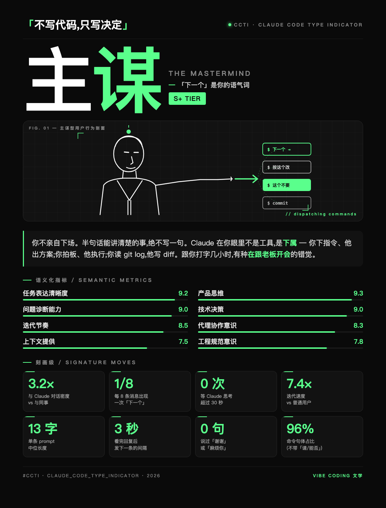

# CCTI · Claude Code Type Indicator

> 🇬🇧 [English README](./README.md)

> *「你是主谋(The Mastermind)、保姆(The Caregiver),还是 Yolo 王(The Yolo)?」*
>
> 一个 Claude Code skill — 读你这段会话里和 Claude 协作的样子,
> 输出一张 1080×1420 的分享图卡:16 型人格、8 项学术指标评分、
> 8 个刻画级行为标签,黑白绿极简风,SBTI 同款基因。

<p align="center">
  
</p>

> 上图:一段真实的 Claude Code 长会话跑出的卡,用户最终归属
> **ITSR · 主谋(The Mastermind)**,S+ 档。英文名下面那行
> 「`「下一个」是你的语气词`」是该型的**一行画像**。8 项学术指标和
> 8 个刻画级数据填满剩余画面。

## ⏳ 在长会话里用

CCTI 是**行为测**,不是问卷。Claude 是看你这段会话**实际做了什么**来打分 —
prompt 长度分布、动词/名词比、「下一个」「按这个改」出现频率、验证节奏…
信号需要足够多样本才稳。

**在跑了一阵的会话里临近收尾时用 CCTI**,最佳样本:

- 用户消息 ≥ 15 条
- 跨 ≥ 2 类不同性质的活儿(比如修 bug + 加功能,或重构 + 写文档)
- 至少有一次你**反驳过 / 纠正过** Claude

如果是「你好测一下我」这种刚开局的会话,出来的卡更像抛硬币,**没有真实读数**。
skill 仍然会出图,只是不准。

**自然的触发时机**:

> *「把今天这个会话当样本,跑一下 CCTI 看看我是哪种。」*

---

这份 README 写给 **AI agent** 看(其他 Claude Code 实例、agent 框架、
或在 skill 上做工具的开发者)。给用户看的工作流见 [`SKILL.md`](./SKILL.md);
评分细则见 [`references/scoring_rubric.md`](./references/scoring_rubric.md)。

---

## skill 做什么

被触发时,它会:

1. 读用户在当前会话的行为 — 消息长度、命令句占比、验证频率等
2. 把行为映射到 4 个二元轴(`F/I`、`T/V`、`S/M`、`P/R`)→ 落到 16 个 archetype 之一(如 `ITSR`)
3. 给 8 项学术指标打 0–10 分(任务表达清晰度、产品思维、问题诊断、技术决策、迭代节奏、代理协作、上下文提供、工程规范)
4. 按 8 项均值映射出 Tier(S+ / S / A / B / C)
5. 按 4 字母轴码挑 8 个刻画级数据
6. 套 `assets/template.html` 模板,占位符替换
7. 调 `scripts/render.py` 出 PNG(跨平台调用 Chrome / Chromium / Edge / Brave headless)
8. 调 `scripts/open_image.py` 用系统默认看图器打开 PNG

输出就一张 PNG。skill 故意只做一件事。

---

## 触发关键词

`SKILL.md` 的 description 字段对以下场景敏感:

- **直接喊**:「测一下我」「CCTI」「Claude Code 人格测试」「我是哪种 Claude Code 用户」
- **间接喊**:「vibe coding 人格」「评价一下我用 Claude 的方式」「出张分享图总结我的协作风格」

**不会被触发**:
- 通用 MBTI / 五行 / 星座 / 八字 — 这些是别的人格系统
- 没有明确点名要测的长会话
- 普通代码审查 / 重构请求(归别的 skill 管)

---

## 安装

### 作为用户级 Claude Code skill

```bash
mkdir -p ~/.claude/skills
git clone https://github.com/parsonssss/ccti.git ~/.claude/skills/ccti
```

重启 Claude Code(或随便发条命令 — skill 是懒加载的)。`ccti` 应该出现在可用 skill 列表里。

### 作为 plugin 打包的 skill

把整个 `ccti/` 目录复制进你 plugin 的 `skills/` 文件夹。skill 是自包含的:
没有外部 Python 依赖(只用标准库),只需要宿主机上有 Chromium 家族浏览器。

---

## 文件结构

```
ccti/
├── SKILL.md                  主入口 — Claude 被触发后跟着走的流程
├── README.md                 英文 README
├── README_zh.md              本文档(中文)
├── assets/
│   ├── archetypes.json       16 型定义 + 4 轴 + 8 指标 + 8 刻画级模板
│   └── template.html         占位符版可视化模板
├── references/
│   └── scoring_rubric.md     完整评分细则(4 轴判定 + 8 指标 + Tier 映射)
├── scripts/
│   ├── render.py             跨平台 HTML → PNG(Chrome/Chromium/Edge/Brave)
│   └── open_image.py         跨平台开图(open / startfile / xdg-open)
├── examples/
│   └── sample-itsr-mastermind.png   示例卡
└── output/                   生成的卡片落地处(被 .gitignore 忽略)
```

---

## 16 型

每一型是 4 字母编码:

```
F / I  ·  T / V  ·  S / M  ·  P / R
```

- `F` Field Commander(亲自下场) vs `I` Idea Person(只下指令)
- `T` Terse(简短) vs `V` Verbose(长 context)
- `S` Sprint(冲刺) vs `M` Marathon(长跑)
- `P` Paranoid(验证狂) vs `R` Reckless(yolo 派)

| 编码 | 中文 | English | 一行画像 |
|---|---|---|---|
| FTSP | 稽查官 | The Inspector | 每行 diff 都要审、不验证不放心 |
| FTSR | Yolo 王 | The Yolo | 不读 diff 直接 git push |
| FTMP | 冷面铁匠 | The Smith | 一行代码改 8 遍直到顺眼 |
| FTMR | 摸鱼大师 | The Slacker | 自己写,但永远赶在下班前才 push |
| FVSP | 学究 | The Scholar | prompt 像 RFC 文档,跑得还飞快 |
| FVSR | 主播 | The Streamer | 边写边直播,完美主义但不测 |
| FVMP | 保姆 | The Caregiver | 每条 prompt 800 字解释上下文 |
| FVMR | 论文人 | The Theorist | 讨论 2 小时,代码 8 行 |
| ITSP | 总监 | The Director | 短指令 + 每条都扫 diff |
| ITSR | 主谋 | The Mastermind | 「下一个」是你的语气词 |
| ITMP | 策划官 | The Strategist | 每周开一次「人机对齐会」 |
| ITMR | 远程老板 | The Remote Boss | 你看着办,我下班了 |
| IVSP | 教练 | The Coach | 「why」讲透,每条都验 |
| IVSR | 灵感发射器 | The Spark | 改 3 次需求最后回到第一版 |
| IVMP | 导师 | The Mentor | 给 Claude 布置题、批 draft、打回重写 |
| IVMR | 画饼大师 | The Visionary | 战略 PPT 比代码长 |

**没有"最好的"型**。Tier(S+/S/A/B/C)和 archetype 是两个独立维度 ——
档位是 8 项指标均值算出来的,跟 4 字母轴码没关系。

---

## 8 项学术指标

| Key | 中文 | 看什么 |
|---|---|---|
| `task_clarity` | 任务表达清晰度 | 每条 prompt 是否带 verb + scope |
| `product_thinking` | 产品思维 | 是否从产品/用户视角切入 |
| `diagnostics` | 问题诊断能力 | bug 报告是否精准到能定位 root cause |
| `technical_decisions` | 技术决策 | 多选项时是否果断拍板、是否有理由 |
| `iteration_cadence` | 迭代节奏 | 推进流畅 vs 大批量堆压 |
| `agent_collaboration` | 代理协作意识 | 出错时打回 Claude 还是默默自己改 |
| `context_provision` | 上下文提供 | 路径 / 文件 / 截图给得到不到位 |
| `engineering_discipline` | 工程规范意识 | 是否主动 tag / changelog / 文档 / 测试 |

每项 0.0–10.0,带一位小数。均值 → Tier 映射规则见 `references/scoring_rubric.md`。

---

## 8 项刻画级(Signature Moves)

按用户的 4 个轴字母从 `archetypes.json` 的 `signature_stat_templates` 里挑。
**允许 ±20% 微调**以贴合实际观察。

刻画级**不是精确测量** — 目的是让用户笑着说"卧槽这就是我"。ITSR 主谋档的示例:

- `3.2×` — 与 Claude 对话密度 vs 与同事
- `1/8` — 每 8 条消息出现一次「下一个」
- `0 次` — 等 Claude 思考超过 30 秒
- `7.4×` — 迭代速度 vs 普通用户
- `13 字` — 单条 prompt 中位长度
- `3 秒` — 看完回复后发下一条的间隔
- `0 句` — 说过「谢谢」或「麻烦你」
- `96%` — 命令句体占比(不带「请/能否」)

---

## 跨平台渲染

`scripts/render.py` 浏览器检测顺序:

| 平台 | 顺序 |
|---|---|
| macOS | Chrome → Chrome Canary → Chromium → Edge → Brave |
| Windows | Chrome (Program Files / x86 / LocalAppData) → Edge → Chromium → Brave |
| Linux | google-chrome → chromium → chromium-browser → snap chromium → edge → brave |

都没找到时回退到 `shutil.which()` 在 `PATH` 里搜。完全找不到 → 报「无 Chromium 家族浏览器」并明确退出,**绝不静默失败**。

`scripts/open_image.py` 打开 PNG 的策略:

| 平台 | 实现 |
|---|---|
| macOS | `open <path>` |
| Windows | `os.startfile(path)` |
| Linux | `xdg-open` → `gio open` → `gvfs-open` → `kde-open5` → `kde-open` |

---

## 自定义

### 改外观

改 `assets/template.html`。整张卡是纯 HTML + CSS + 内联 SVG,无外部资源。
保留 `{{PLACEHOLDER}}` 不动 — agent 在渲染时会替换。

### 改 archetype

改 `assets/archetypes.json`:

- 改名字 / 画像句 → `archetypes.<编码>.name_cn` / `name_en` / `tagline`
- 改解释段 → `archetypes.<编码>.explanation`(支持 `<strong>` 标签做绿色强调)
- 改刻画级数据 → `signature_stat_templates`

### 加新轴

**暂不支持**。当前固定 4 轴(16 组合)。加第 5 个轴就是 32 组合,要重新设计
整个映射 — 想要的话,fork 一份重做。

---

## 诚实说明

- **不是经过验证的心理测量工具**。「16 型」是装饰性的 framing,agent
  只看一段会话就做出有自信的判断,**当娱乐就好**
- **是为中文 Claude Code 用户调校的**。archetype 名字 + 画像句都是中文,
  英文名只为跨语种可读
- **只反映这段会话**。不是用户整体工程能力的评测 —— 同一个人在 debug 重活和
  在 greenfield 设计时,跑出来的型可能完全不同
- **刻画级数据是示意性的**。要的是「**感觉准**」而不是「审计级精确」,
  允许 agent ±20% 漂移

---

## 给 agent 的集成接口

如果你要在 Claude Code skill 触发机制之外**程序化调用 CCTI**:

1. 读 `assets/archetypes.json` 拿到 16 型目录
2. 在你的应用里实现会话 → 评分逻辑
3. 选 archetype + 算 score + 选刻画级
4. 用 `str.replace` 把 `assets/template.html` 里所有 `{{PLACEHOLDER}}` 替换掉
5. 把填好的 HTML 写到磁盘,调 `scripts/render.py <html> <png>`
6. 可选:调 `scripts/open_image.py <png>` 打开

render / open 两个脚本**没有 Claude Code 相关依赖**,有 `python3` + 任一
Chromium 家族浏览器就能独立跑。

---

## License

MIT。Fork 它,改它,做你自己的版本 — 16 型设计师、16 型 PM、
16 型游戏玩家、16 型猫 …… 同一套模板,换一套评分细则就是新产品。

本 skill 由一次 Claude Code 会话设计出来 — 系统、给出用户案例、打包成可复用
skill。那次会话本身就是 ITSR(主谋 / The Mastermind)型的好样本。
